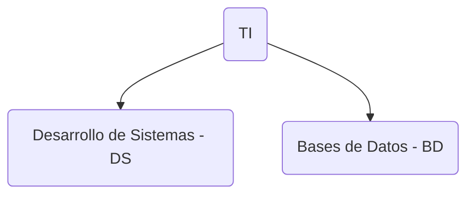

## Calidad

Hay que poner la política de la calidad: es como organiza la organización para seguir mejorando la calidad (documentación clara, )

Manual de calidad es lo que se va a mostrar, todos tienen que saber esto, tienen que tener la documentación de los procesos, etc. Por esto se tiene que hacer actividad 1, después 2, después 3, etc.

Sistema de Calidad: Documentación, Manuales, manual de calidad

Calidad: Lo establece la parte de arriba de la organización los directivos. Es cuando se hace algo, pero se hace con procesos claros medibles y repetibles.

Manual de calidad:
- Lista de procesos

Proceso:
- Costo
- Conexiones con otros sistemas/procesos

De haber algún error en la documentación es culpa de el que lo firmo y el que generó la documentación
Se tiene que evidenciar los pasos de la documentación además de mostrar los pasos de la documentación

Cuando se desechan los documentos obsoletos, ley de retención de documentos lo define

Problema 1: Entra el jefe del área de bases de datos

Observación. cuando el requisitos está pero le falta algo
No conformidad menor

## Tareas
- [ ] Hacer un ensayo utilizando, sobre la importancia de la calidad y la seguridad de información y la administración de riesgos sobre la administración de bases de datos (se puede usar ChatGPT) 📅 2023-08-07 🔼 [[Tarea 2 - Ensayo Calidad y Seguridad en bases de datos]]
- [ ] Traer avances de la aplicación web📅 2023-08-10 [[Proyecto Avance 1]]