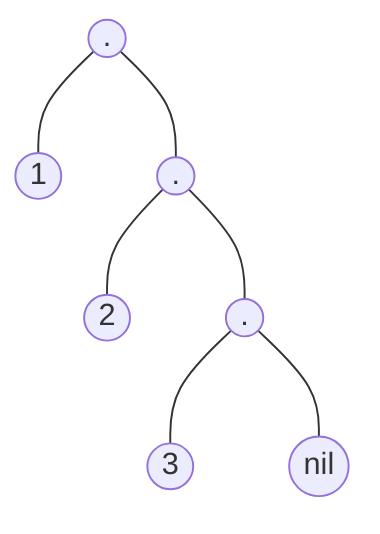

También son AST
utiliza el constructor DOT

Por ejemplo la lista L = [1,2,3] es:

Siendo nil el nodo indicando el final de la lista


El siguiente código es igual que length(+L, -N). Es un algoritmo O(n) en Prolog.
```Prolog
% largo(+L, -N) : true si la lista L tiene N elementos
% Por recursion

% Recursiva de pila
largo( [], 0 ). % Caso base
largo( [ _ | R ], N ) :- largo(R, LR), 
					N is LR + 1
.

% Recursivo de cola (tail recursion)
largo_rc(L, N) :-
	largo_running(L, 0, N)
.

largo_running([], A, A).
largo_running( [ _ | R ], A, N ) :- 
	A1 is A + 1,
	largo_running(R, A1, N)
.
```

El siguiente código es igual que el append(?L1, ?L2, ?LT).
```Prolog
% pegar(?A, ?B, ?C) : true si C es la concatenacion de A con B ese orden
pegar( [], B, B ).
pegar( [F | A], B, [F | C] ) :- pegar(A, B, C). 
```

El siguiente código es igual que el member(?E, ?L). Es como hacer un loop de una lista.