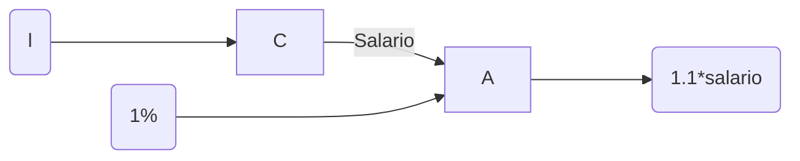

>[!quote] Knuth
> *Programming is the art of telling another human being what one wants the computer to do*

Uno programa pensando en pipes (tuberías)
![[Drawing 2023-08-28 19.14.46.excalidraw]]

Pasando el mismo código de imperativo a funcional
```javascript
function sumArray(a) { // imperativos
	let s = 0
	for (let i = 0; i < a.length; i++)
		s += s[i]
	return s
}

function sumArray(a) {
	let s = 0
	for (let e of a) // para asegurar el valor de e no lo quiten se hace (siguiente)
		s += e
	return s
}

function sumArray(a) {
	let s = 0
	for (const e of a)
		s += e
	return s
}

function sumArray(a) {
	return 
}

```

>[!info] Function in javascript
>En javascript las funciones son un objeto como cualquier cosa, son un valor
>Se puede definir como let foo = entrada => valor a retornar
>el => : return
![[Pasted image 20230828193125.png]]

Uno no cambia los datos que le dieron, los respeta
ver pero no tocar
`let succ = n => n + 1` en vez de hacer `let succ = n => n++`
	Bien!!!!                                   Mal!!!

![[Pasted image 20230828193711.png]]
apply es una función [[lambda]]


## Composición de funciones
Se tiene un empleado 'e', al cual se le puede calcular el salario. Para calcular dicho salario se construye una función. Ahora, haciendo uso de una nueva función, incluyendo un parámetro externo, puedes construir una función que calcules el salario con aumentos. La composición de funciones es juntar estas funciones en una sola que, en este caso, retorna el salario con aumento.

"Hola" + "!" = "Hola!"
Composición



f: A -> B
g: B -> C
fog: A -> C

```javascript
let f = x => 2 * x

let g = x => x ** 2

let comp = (f,g) => ( x => g(f(x)) )

let human = x => 4 * x ** 2

let fog = comp(f,g)

let a = [10, 3, 56]

a.forEach( e => console.log(`$fog(x)`) )
```

>[!info] Principio
> 1. Función como objeto
> 2. Evitar Mutación y Efectos Secundarios (Transparencia Referencial)
> 	1. Que si x es entrada, x no cambió, puedo volver a hacer F(x) después de hacer F(x), para el mismo resultado
> 	2. Que no se edite algo fuera del scope, si entra x y sale y, no editar un z externo porque no se sabe para que se usa y rompe la razonabilidad de código
> 3. Preferir usar expresiones sobre estatutos
> 4. Programar === Tuberias (Pipe) A -> B -> C [[Programación Fluido (Fluente)]]


Problema: en programación funcional haga que compare dos elementos y devuelva según una comparación
```javascript
// solucion original mia

compar = (x,y,f) => {
	if (f(x,y)) return x
	return y
}
```

```javascript
// solucion profe, mejor
compare = (x,y,p) => p(x,y) ? x : y // ternario
```

Segundo ejemplo: algo que no se debería hacer

```javascript
let z = 0
const add = (x,y) => {z++; return x+y}
```

Tercer ejemplo: imprimir todos los elementos de un array
```javascript
function print_array(a) { // mal hecho
	for(const e of a)
		console.log(e)
}

const print_array_fp = (a) => a.forEach(e => console.log(e)) // bien hecho
```

```javascript
function print_array_mod(a) {
	for (const e of a)
		console.log(e)
}

const print_array_mod_fp = (a) => a.filter(e => e % 2 === 0)
								   .forEach(e =? console.log(e))
```

Antes: OOP + Imperative (IP)

Ahora: OOP + FP

La programación funcional ofrece [[Patrones (Combinadores)]]