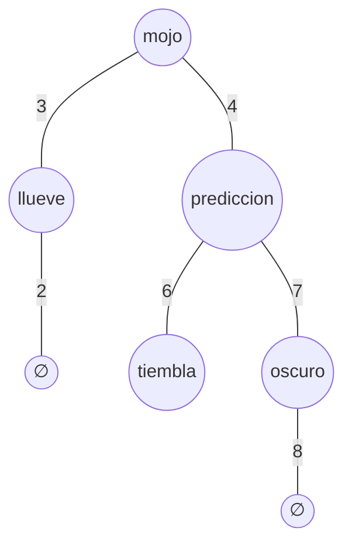

Prolog es un lenguaje creado en el 1974 para la generación de [[Inteligencia Artificial]], [[LISP]] termina siendo la versión estadounidense del MIT para responder a esto.

Se origina en Europa (Francia), lo adopta Japón donde aún tiene un nicho el lenguaje.

La versión mejor Open Source según Loría es SWI-Prolog, Holanda tiene su propia versión llamada CWI

![[Prolog 2023-10-19 18.23.09.excalidraw]]

```swi-prolog
writeln('hello world!').
```
Prolog es un lenguaje para probar teoremas entonces todo lo que se escribe tiene true o false, pero se usa para programar

![[Pasted image 20230731192418.png]]

![[Pasted image 20231019190500.png]]
la segunda da falso porque Prolog no hace operaciones, sino que como los dos son árboles, entonces evalúa los árboles de cada lado del = y no da verdadero

Para hacer esto se hace:
![[Pasted image 20231019190939.png]]

Si R tiene varias respuestas, entonces manda un iterador para las soluciones infinitas, pero las manda todas
En términos de soluciones es [[Lazy]], pero el '10 - 9' sería [[Eager]]

![[Prolog 2023-10-19 18.46.20.excalidraw]]

> [!info] Properties
> - writeln() siempre da verdadero
> - '=' is the '\=\='
> - \<Letter in CAPS\> = number (true only if variable is that number), has to be caps
> - ',' is like saying 'and'
> 	- al concatenar ','s  va de izquierda a derecha y termina cuando encuentre el falso
> 	![[Pasted image 20231019185626.png]]
> 	Por esto no imprime el 'B'
> - 'is' is like saying '='
> - ![[Pasted image 20231019185909.png]]
>	Daría falso porque 'x' es [[átomo (Prolog)]]
>	x = 'x' porque los dos son [[átomo (Prolog)]]

![[Prolog 2023-10-19 18.59.48.excalidraw]]

![[Pasted image 20231019190710.png]]

![[campeon.pl]]
```swi-prolog
% Comantario de una linea
/*
Multilinea
*/

% campeon(E, A) : true sii Equipo E fue campeon en año A
% Equipo: csh, lda, csc, darissa, ...
% Año: un entero
% Axiomas o facts
campeon(csh, 1921).
campeon(csh, 1922).
campeon(csc, 1923).
campeon(csh, 1924).
campeon(lib, 1925).
campeon(lib, 1926).
campeon(lda, 1928).
campeon(lda, 1939).
campeon(ucr, 1943).
campeon(daprissa, 1952).
campeon(daprissa, 1953).
campeon(daprissa, 1957).
campeon(lda, 1958).
campeon(lda, 1959).
campeon(lda, 1960).
```

![[Pasted image 20231019193250.png]]
el \[\] se le llama carga, sirve como import
':-' se lee como 'si' (if) ([[Clausula (Prolog)]])
buscar sobre sort


```testing.pl
llueve.
mojo :- llueve.
mojo :- prediccion.
prediccion :- tiembla.
prediccion :- oscuro.
oscuro.
```
```swi-prolog
[testing]
mojo.
> true.
> <mensaje de error>
```

Esto anterior va a dar error porque no se puede probar tiembla, por

Los $\varnothing$ implica true, por lo tanto llueve y oscuro devuelven true pero tiembla no se puede probar, como intenta de evaluar tiembla primero entonces no llega evaluar oscuro por lo cual no logra llegar a true de oscuro y el debugger frena en tiembla.
```testing.pl
llueve.
mojo :- llueve.
mojo :- prediccion.
prediccion :- tiembla.
prediccion :- oscuro.
oscuro.
tiembla :- random(P), P > 0.75.
```
```swi-prolog
[testing]
mojo.
> true,
> true,
> true.
```


Prolog todo es AST, el programa es AST, las [[Clausula (Prolog)]]s son AST, los [[compuesto (Prolog)]]s son AST

Requiere programar con [[desestructuración]]