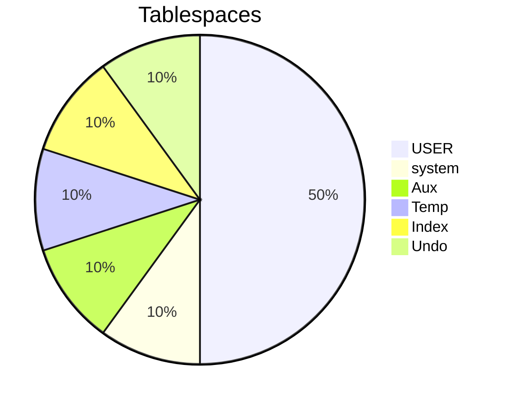

realiza correcciones a la estructura si o no

- [ ] desarrolle un algoritmo que sea capaz de calcular el consumo diario de espacio en un tablespace, considerando únicamente tablas e indices asociados a las tablas y una taza de transacción, proporcionada como argumento o parámetro del algoritmo