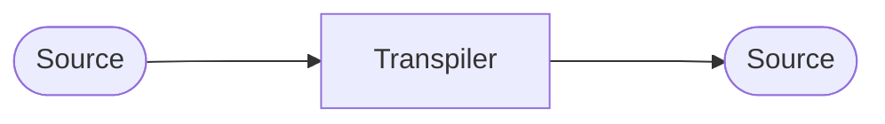

Es un proceso igual que la [[Compilación]]
Pero en vez de llegar a target se llega a otro source


Typescript ---> Transpiler ---> Javascript como un ejemplo
```typescript
let x:number | string = 32
x = "Venegs"
console.log("devil=",x)
```

```javascript
// Codigo en estándar ES5
var x = 32;
x = "Venegas";
console.log("devil=",x);

//--------------------------------------------

// Codigo en estándar ES6
let x = 32;
x = "Venegas";
console.log("devil=",x);
```
