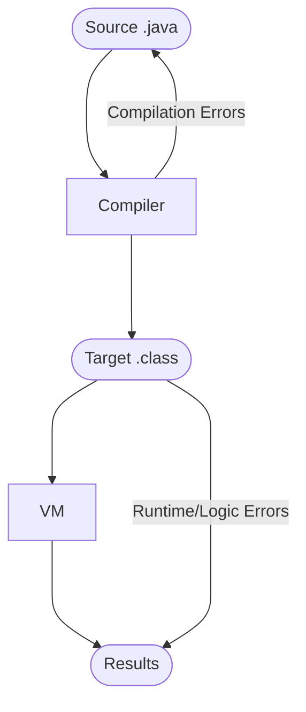
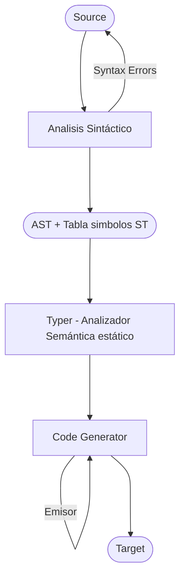

```java
public class Determinante{
	public static int det(int a, int b, int c) {
		return b*b - 4*a*c;
	}
}
```

Se intenta WORA (write once run always)

El compilador genera un archivo byte code, para que el interpretador (maquina virtual) lo ejecute

Es lento porque hay doble ejecución: la ejecución sobre el hardware y la ejecución sobre la máquina virtual

javap es un descompilador

Abstract Syntax Tree (AST):
El compilador genera todo el código en un AST, y lo recorre en un Post-Orden (LeftRightRoot)

Post-Orden (aka. notación polaca inversa): bb\*4a\*c\*- 

![[Drawing 2023-08-07 19.05.38.excalidraw]]


```
public class Determinante {
  public Determinante();
    Code:
       0: aload_0
       1: invokespecial #1                  // Method java/lang/Object."<init>":()V
       4: return

  public static int det(int, int, int);
    Code:
       0: iload_1
       1: iload_1
       2: imul
       3: iconst_4
       4: iload_0
       5: imul
       6: iload_2
       7: imul
       8: isub
       9: ireturn
}
```
```java
public class Determinante{
	public static int det(int a, int b, int c) {
		return b * b - 4 * a * c;
	}
	public static int howManySolutions(int a, int b, int c) {
		var x = det(a, b, c);
		if (x > 0) { return 2; }
		if (x == 0) { return 1; }
		return 0;
	}
}
```

Dentro del compilador:

Tipos de errores de sintaxis:
- se olvido un ;
- se olvido un (
- Mal uso de palabras reservadas

[[Typer]]: busca pulgas de semántica