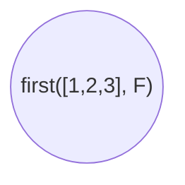
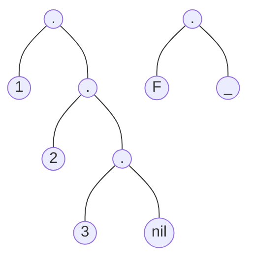

```first.pl
%first(?L, ?F) si F es el primer elemento de la lista L
first([F | _], F).
```
Se utiliza [[Listas (Prolog)]]
También acordarse que el underscore es que va una variable pero no importa lo que vaya ahí

Acordar en las definiciones de funciones el + de la variables es input el - es output, el ? es los dos




$[1,2,3]$         $\cong$        $[F|\_]$ 


```first.pl

% rest(L, R) para sacar el resto de la lista
rest([_|R], R).

% second([_ | [S | _]], S).
second([_, S | _], S).


```
